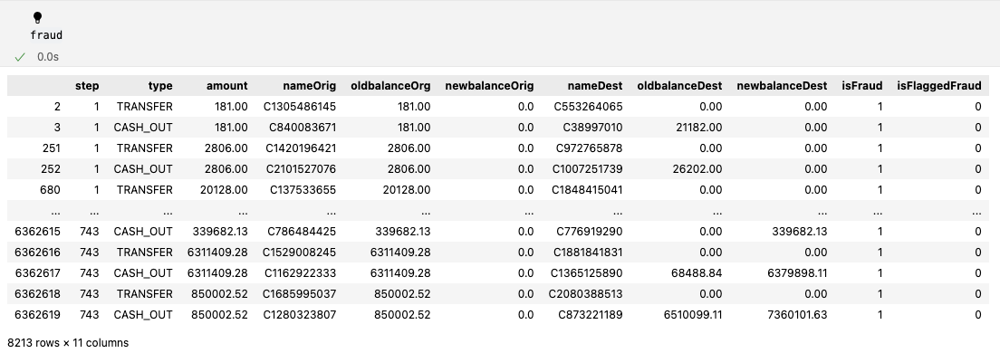

# Fraud Detection Analysis and Prediction :mag:

Welcome to the Fraud Analysis and Prediction project :rocket: We will be looking into a large data set and with using 
machine learning, figure out what accounts are fraud or not. Dive in to explore the data, modeling process and key findings.

## Modules/Libaries
* Pandas
* Seaborn
* Numpy 
* MatplotLib
* Scikit-learn


## Dataset Overview 
We will take a look at our Financial Data Set and give a few insights and points and draw a hypothesis given what we've looked at...

* Step: A unit of time that represents hours in the data. Think of this as the timestamp of the transaction (e.g hour 1, hour 2....hour 534, ...)

* Type: The type of transaction 

* Amount: The amount of money transferred 

* NameOrig: The origin account name 

* OldBalanceorg: The origin accounts balance before the transaction

* NewBalanceDest: The destination accounts balance after the transaction 

* IsFlaggedfraud: A "Naive" model that simply flags a transaction as fraudulent if it is greater than 200,000 (not that this currency is not USD)

* IsFraud: Was this simulated transaction actually fradulent? In this case, we condier "fraud" to be malicious transaction that aimed to transfer funds out of a victim's bank
account before the account owener could secure their information. 


## Univariate Analysis 
### Fraud vs Genuine


* The dataset is highly imbalanced, with 99.9% of transactions being non-fraudulent (6,354,407 accounts).
* In contrast, only 0.01% of transactions are flagged as fraudulent (8,213 accounts).

This imbalance is crucial to consider when building a fraud detection model, 
as traditional machine learning models may struggle to identify fraudulent cases due to their rarity.

### Flagged Transactions vs Unflagged Transactions


* Flagged as fraud: Only 6 transactions
* Not flagged: 6,362,604

This indicates that very few cases are proactively flagged, suggesting that our fraud 
dection
system must be highly sensitve to subtle fradulent patterns. 

### Count Types


* Payment and cash_out are the 2 most common types within this data 

*Made dataframes where all the acounts were pulled for Fraud, Not Fraud, Flagged and Not Flagged 
and looked for any patterns*

```python 

#This pulls all the data where the account was fraud
fraud = df[df["isFraud"] == 1] 
#Pulls the data where the accounts were not fraud
Notfraud = df[df["isFraud"] == 0]

#Pulls all the data for what and what is not flagged fraud 
IsFlaggedFraud_df = df[df["isFlaggedFraud"] == 1]
IsNotFlaggedFraud_df = df[df["isFlaggedFraud"] == 0]

``` 
* I looked at a few of these dataframes for patterns 

1. ## *fraud Dataframe* 

* Only transfers were being marked fraud 


### *Count of Fraud with hue*
   - We see a class imbalance here as more than 95% of samples belong to not fraud (0) compared to is Fraud
   - Payment and Cash out are the most common types under not fraud 
   - Debit is the least common type under not fraud 
   - Only types we see under fraud is Cash out and transfers

### *What types are fraud*
  - This looks deeper into the isFraud types from the first bar plot
  - Transfers are the most common type under fraud 

2. ## *IsFlaggedFraud_df*

- Only transfers were being flagged fraud 

3. ## *IsNotFlaggedFraud_df*

- Some accounts that were fraud , weren't flagged as fraud 


### *Count of flagged fraud with hue*
- Shows flagged fraud cases by transaction type
- Most transactions were NOT flagged as fraud
- Payment , Cash_out and Cash in are the most common transaction types
- Only Transfers were flagged (you can see this in the bar plot but we do notice this very well in the IsFlaggedFraud_df dataframe)
### *What types are flagged as fraud?*
- Highlights transaction types that get flagged as fraud
- Flagged fraud cases are mostly Transfers
### *Fraud cases that weren't flagged as fraud*
- Focuses on fraud cases that were missed (not flagged)
- Useful for identifying gaps in fraud detection
- We see that there are a cases of fraud that weren't flagged
- This systems has gaps due to failing fradulent activity effectively


