# Fraud Detection Analysis and Prediction :mag:

Welcome to the Fraud Analysis and Prediction project :rocket: We will be looking into a large data set and with using 
machine learning, figure out what accounts are fraud or not. Dive in to explore the data, modeling process and key findings.

## Modules/Libaries
* Pandas
* Seaborn
* Numpy 
* MatplotLib
* Scikit-learn


## Dataset Overview 
We will take a look at our Financial Data Set and give a few insights and points and draw a hypothesis given what we've looked at...

* Step: A unit of time that represents hours in the data. Think of this as the timestamp of the transaction (e.g hour 1, hour 2....hour 534, ...)

* Type: The type of transaction 

* Amount: The amount of money transferred 

* NameOrig: The origin account name 

* OldBalanceorg: The origin accounts balance before the transaction

* NewBalanceDest: The destination accounts balance after the transaction 

* IsFlaggedfraud: A "Naive" model that simply flags a transaction as fraudulent if it is greater than 200,000 (not that this currency is not USD)

* IsFraud: Was this simulated transaction actually fradulent? In this case, we condier "fraud" to be malicious transaction that aimed to transfer funds out of a victim's bank
account before the account owener could secure their information. 


# Univariate Analysis 
### Fraud vs Genuine


* The dataset is highly imbalanced, with 99.9% of transactions being non-fraudulent (6,354,407 accounts).
* In contrast, only 0.01% of transactions are flagged as fraudulent (8,213 accounts).

This imbalance is crucial to consider when building a fraud detection model, 
as traditional machine learning models may struggle to identify fraudulent cases due to their rarity.

### Flagged Transactions vs Unflagged Transactions


* Flagged as fraud: Only 6 transactions
* Not flagged: 6,362,604

This indicates that very few cases are proactively flagged, suggesting that our fraud 
dection.
system must be highly sensitve to subtle fradulent patterns. 

### Transaction Types


* Payment and cash_out are the 2 most common types within this data 

*Made dataframes where all the acounts were pulled for Fraud, Not Fraud, Flagged and Not Flagged 
and looked for any patterns*

```python 

#This pulls all the data where the account was fraud
fraud = df[df["isFraud"] == 1] 
#Pulls the data where the accounts were not fraud
Notfraud = df[df["isFraud"] == 0]

#Pulls all the data for what and what is not flagged fraud 
IsFlaggedFraud_df = df[df["isFlaggedFraud"] == 1]
IsNotFlaggedFraud_df = df[df["isFlaggedFraud"] == 0]

``` 
* I looked at a few of these dataframes for patterns 

1. ## *Fraud Dataframe* 
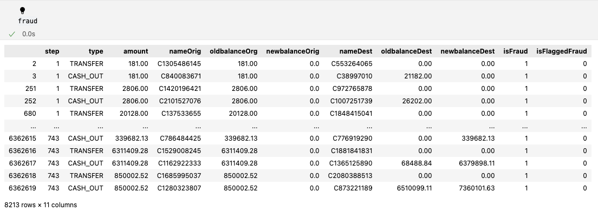
* Only transfers were being marked fraud 


### *Count of Fraud with hue*
   - We see a class imbalance here as more than 95% of samples belong to not fraud (0) compared to is Fraud.
   - Payment and Cash out are the most common types under not fraud.
   - Debit is the least common type under not fraud.
   - Only types we see under fraud is Cash out and transfers.

### *What types are fraud*
  - This looks deeper into the isFraud types from the first bar plot.
  - Transfers are the most common type under fraud. 

2. ## *IsFlaggedFraud_df*
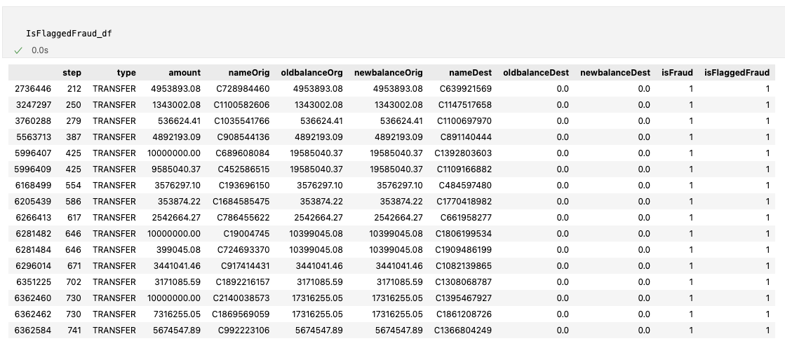
- Only transfers were being flagged fraud. 

3. ## *IsNotFlaggedFraud_df*
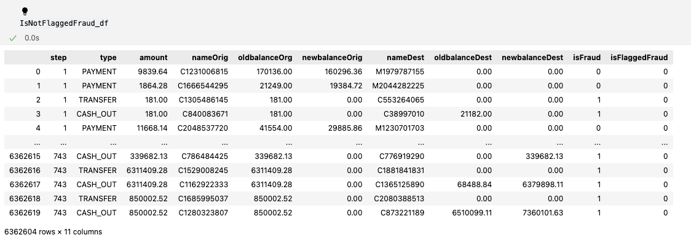
- Some accounts that are fraud , weren't flagged as fraud. 


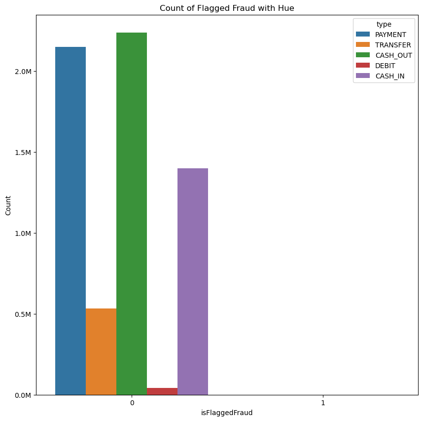
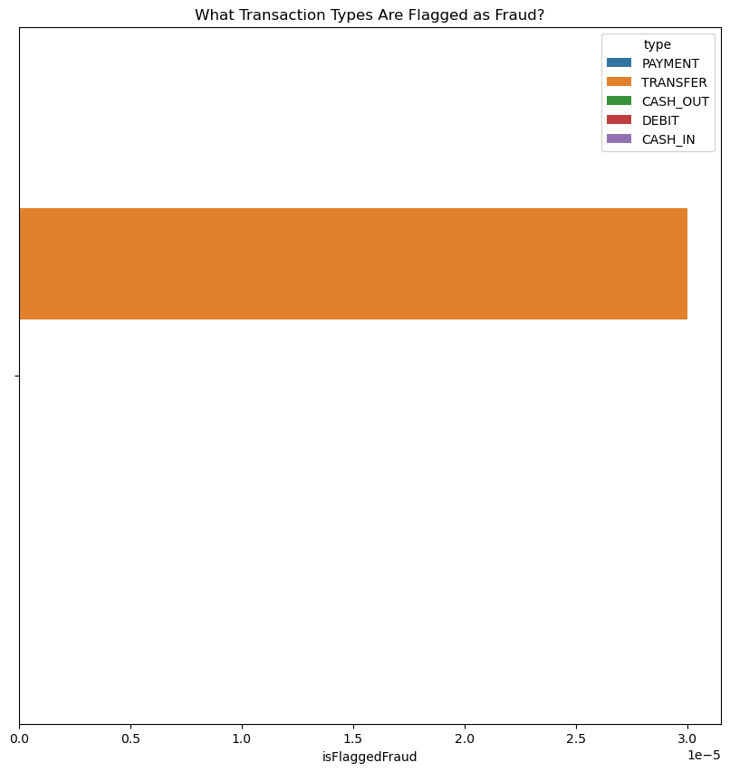
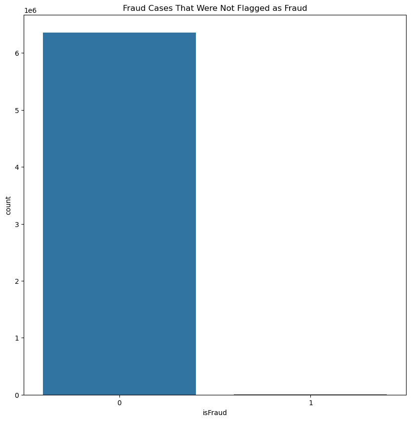

### *Count of flagged fraud with hue*
- Shows flagged fraud cases by transaction type.
- Most transactions were NOT flagged as fraud.
- Payment , Cash_out and Cash in are the most common transaction types.
- Only Transfers were flagged (you can see this in the bar plot but we do notice this very well in the IsFlaggedFraud_df dataframe)
### *What types are flagged as fraud?*
- Highlights transaction types that get flagged as fraud.
- Flagged fraud cases are mostly Transfers.
### *Fraud cases that weren't flagged as fraud*
- Focuses on fraud cases that were missed (not flagged).
- Useful for identifying gaps in fraud detection.
- We see that there are a cases of fraud that weren't flagged.
- This systems has gaps due to failing fradulent activity effectively.

## Distribution of Step & Amount 
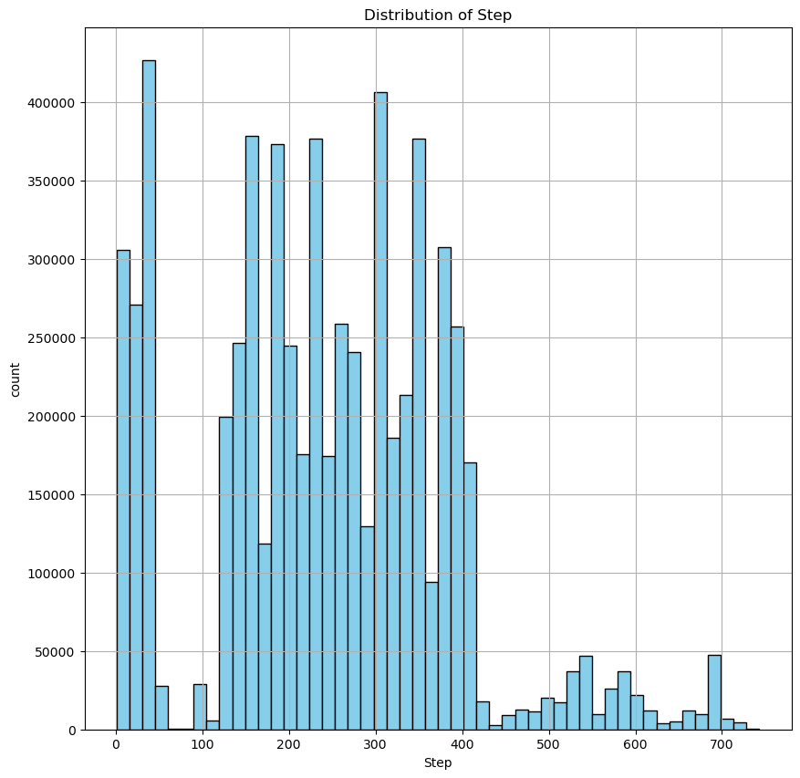
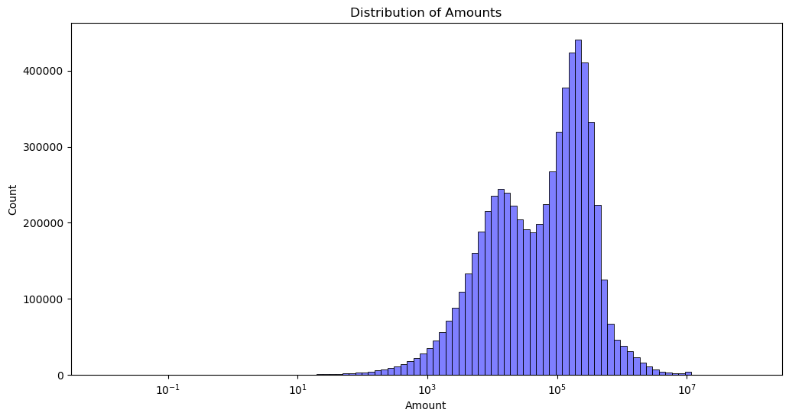

### *Distribution of Step*
  - The counts where transactions occurred at a time stamp.
  - the most common time stamps were  around 1, 200, & 300, we can assume that since there were alot of movements here.
  - potential movements where step increaseses could be were fraud occurred.
  - Decline in activity over time. 

### *Distribution of Amounts*
  - The majority of transactions fall within a specific range, with a clear concentration around 10^5.
  - We have two main peaks, (Bimodal distrubution), meaning transactions are happening aroind two diffrent value ranges.
  - As the amounts increase the transactions decrease , investigating those outliers could be where fraud is occurring. 

# Bivariate Analysis 

## Amount vs Step 
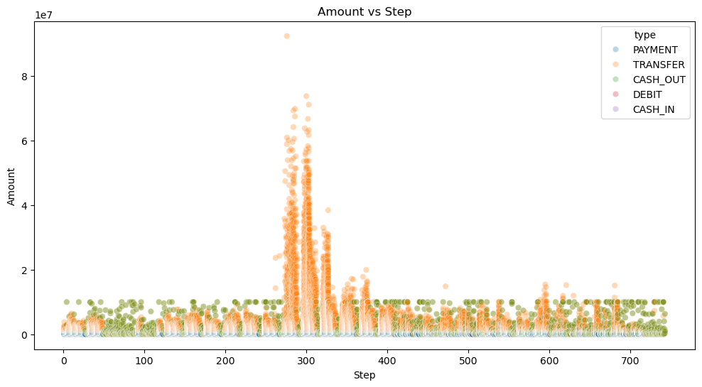

 With in this scatter plot we see that a lot of occurrances happen around the 300 step mark.
- We see a lot of payment transactions here. 
- we have seen a lot of payment and cash out types under fraud, could this be happening at this time interval?


## Box plot to check for outliers 
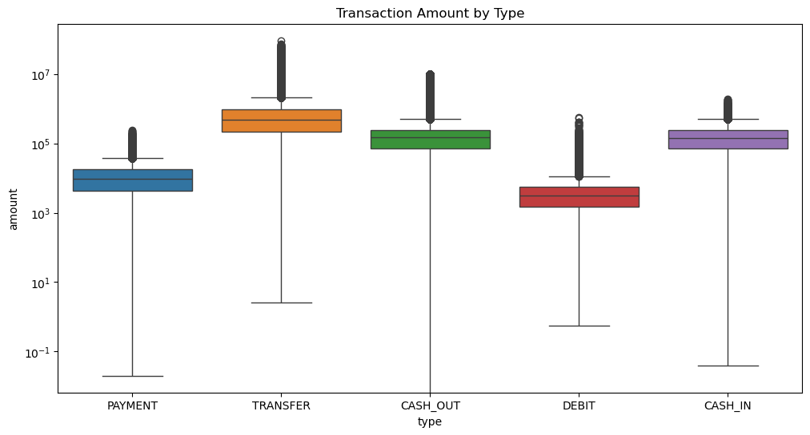
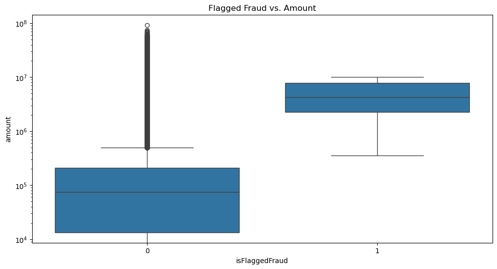
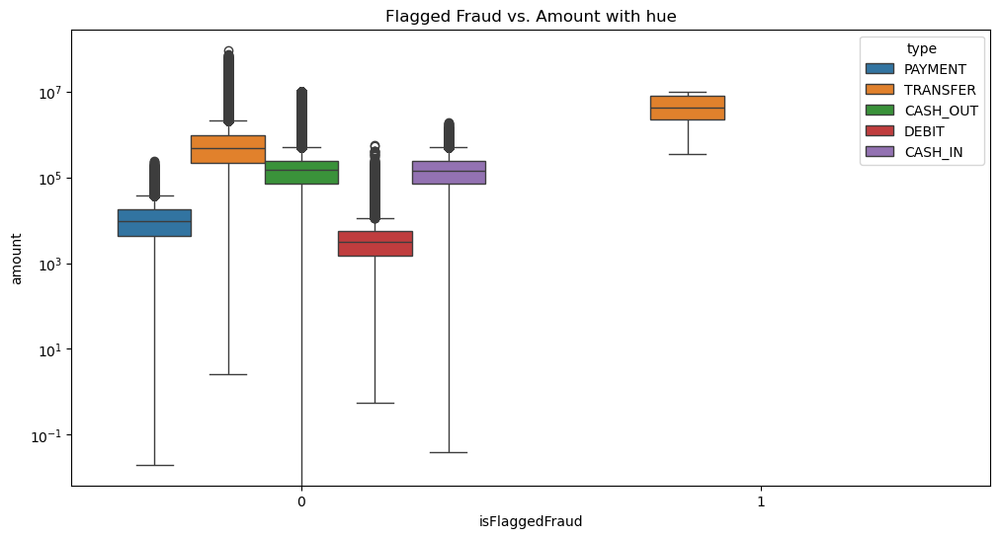

### Transaction amount by type  
 - All the types have outliers as we can see but transfer's and Cash out have the highest outliers in terms of Amount
 - Transfer and cash out also have the highest median transaction amounts 

### Flagged Fraud vs Amount
- Transactions that are flagged as fraud (1) tend to have higher amounts, with a smaller range and fewer extreme outliers.
- Non-flagged transactions (0) show a wider range of values, with some transactions having very high outliers.
- The median transaction amount for flagged fraud cases is significantly higher than non-flagged ones.

### Flagged Fraud vs Amount with hue 
- This takes a closer look into the Flagged Fraud vs Amount box plot
- Transaction amounts vary significantly, with TRANSFER and CASH_OUT transactions 
showing higher median values and a large range.
-  Only Transfer transactions appear under the flagged fraud category.
  - The transaction amounts in this category are relatively high, suggesting that 
  flagged fraud transactions tend to involve large amounts


## Pair plot & observations 
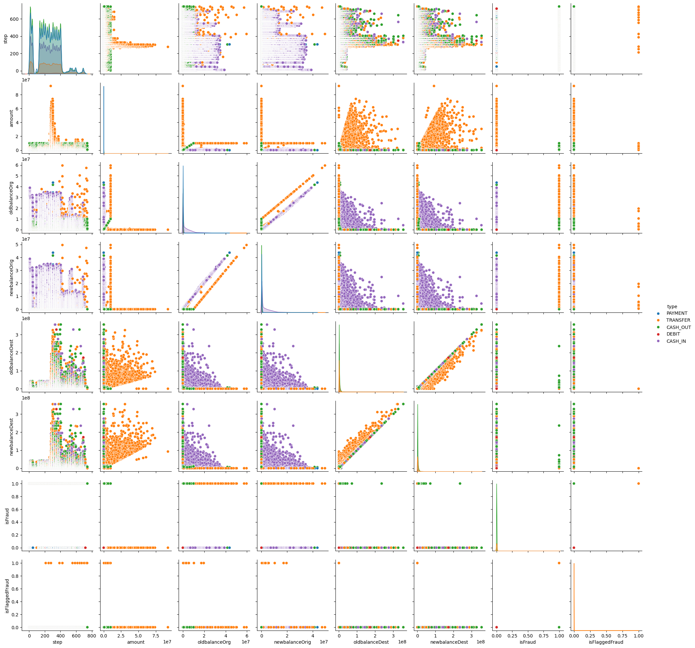

- This visualization helps understand feature relationships, outliers, and potential fraud patterns.
- Features like amount, oldbalanceOrg, and newbalanceOrig are be important for fraud detection.
- Fraud-related points (isFraud) appear clustered in specific areas, particularly within certain transaction types like Transfer and Cash out, suggesting these are more prone to fraud.
-  The isFlaggedFraud feature shows very few flagged transactions, implying that most fraud cases were not automatically detected by the system.


# Multivariate Analysis 

# Heat map

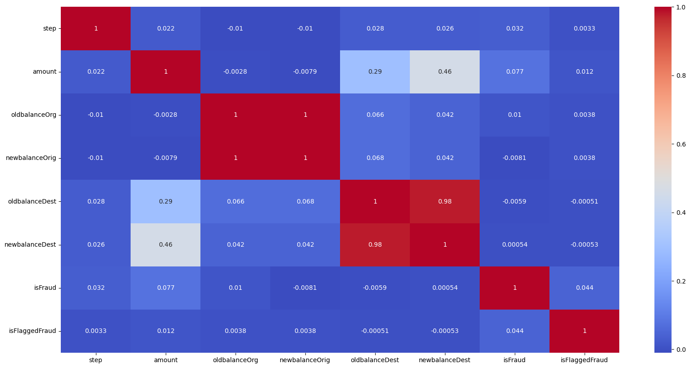

- High Correlation: oldbalanceOrg and newbalanceOrig have a strong correlation as it approx. = 1 but not exactly 1... 
     - To follow up seeing the .98 correlation between oldbalanceDest and newBalanceDest show possible signs of fraud
- Moderate Correlation: Amount shows a moderate correlation with newbalanceDest (0.46) and oldbalanceDest (0.29), suggesting that transaction amounts impact destination balances.
- Weak Correlation with Fraud: isFraud has weak correlations with most features, meaning fraud detection may require more complex patterns beyond simple balance relationships.
- Minimal Correlation for Flagged Fraud: isFlaggedFraud has very low correlation values with other variables, implying that flagged fraud cases may be based on specific rules rather than natural data trends.
- Key Takeaway: Balances are highly connected, but fraud detection is not strongly dependent on individual numeric features, suggesting a need for advanced fraud detection methods.


# 3D Scatter Plots 
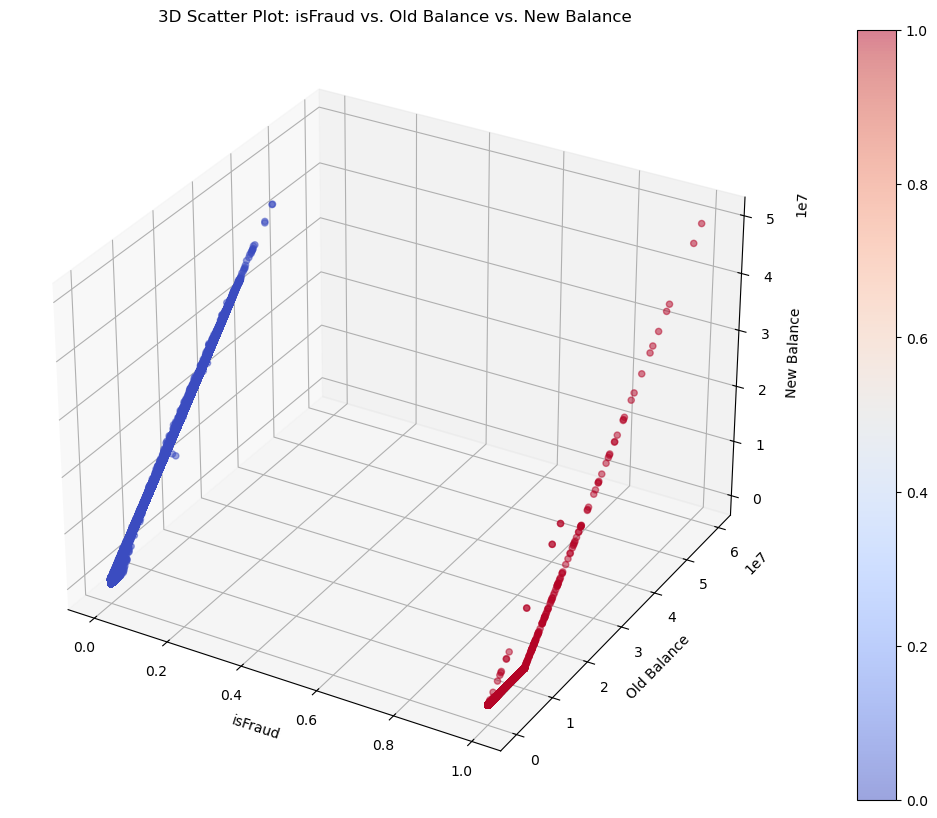
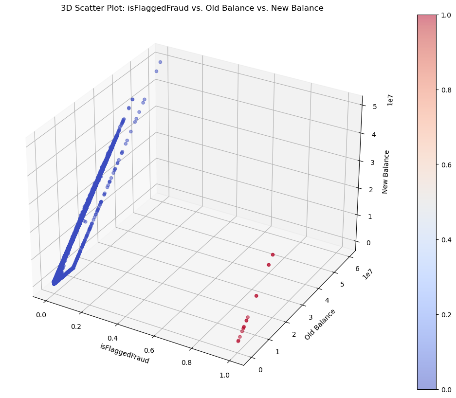

### 3D Scatter Plot: isFraud vs. Old Balance vs. New Balance

- The balances that aren't fraud seem more cluster together , compared to the balances that are fraud 
- balances old and new under fraud have a higher amounts 
- The plot visually demonstrates that fraudulent transactions might be detected based on balance patterns 

### 3D Scatter Plot: isFlaggedFraud vs. Old Balance vs. New Balance
-  The majority of transactions are not flagged as fraud (blue points), while only a small portion of transactions are flagged as fraud (red points). This indicates that fraud-flagging is relatively rare.
- The few red points suggest that only a small subset of transactions gets flagged, meaning the fraud detection system has strict criteria for flagging fraud.(only anything over 200,00 is flagged)

# Machine Learning Modeling 

## Logistic Regression 

``` python

from sklearn.linear_model import LogisticRegression
import numpy as np
from sklearn.model_selection import train_test_split
from sklearn.metrics import roc_curve, auc
import pandas as pd
import matplotlib.pyplot as plt
import seaborn as sns

# read in the cleanded data 
file_path = r"data/cleaned_data.csv"
df = pd.read_csv(file_path)

# Features: All columns except "isFraud"
X = df.drop(columns=["isFraud"])  

# Target: "isFraud" column
y = df["isFraud"]  

#Split data into separate training test set
X_train, X_test, y_train, y_test = train_test_split(X, y, test_size = 0.2, random_state = 42)


# Initialize the model
model = LogisticRegression()
model.fit(X_train , y_train)

#get predicted probabilites for the fraud class 
y_prob = model.predict_proba(X_test)[:,1]

#Calculate the Fasle positive rate , True positive rate  and thresholds using roc_curve
fpr, tpr, thresholds = roc_curve(y_test, y_prob)

# Calculate Youden's J statistic: sensitivity + specificity - 1
youden_j = tpr - fpr

# Find the index of the best threshold
best_threshold_index = youden_j.argmax()

# Get the best threshold and corresponding FPR and TPR 
best_threshold = thresholds[best_threshold_index]
best_fpr = fpr[best_threshold_index]
best_tpr = tpr[best_threshold_index]


#Calculate the Area under curve 
roc_auc = auc(fpr,tpr)

print( "area under curve is ", roc_auc)

```
- This Python script builds a logistic regression model to predict fraud using a cleaned dataset. It first loads the data, separating the features (X) and target variable (y), 
and then splits the data into training and test sets. The logistic regression model is trained on the training set and used to predict probabilities for 
the fraud class on the test set. The script calculates the Receiver Operating Characteristic (ROC) curve and identifies the best threshold for classification 
by maximizing Youden's J statistic, which balances sensitivity and specificity. Finally, it computes and prints the Area Under the Curve (AUC) 
to evaluate the model’s performance in distinguishing between fraud and non-fraud cases.

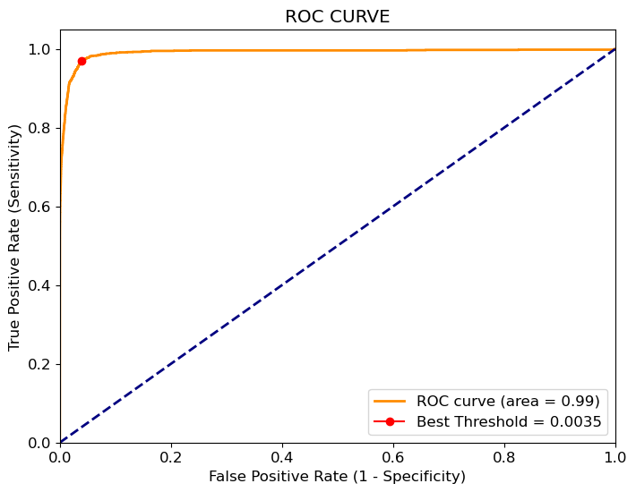
- The red dot represents the optimal threshold found using Youden’s J statistic.
- The best threshold value = 0.0035, meaning that if a predicted fraud probability is ≥ 0.0035, it will be classified as fraud
   - This threshold is chosen to maximize the difference between TPR and FPR, balancing sensitivity and specificity
- AUC of 0.99 shows the model is generally strong at differentiating between classes.

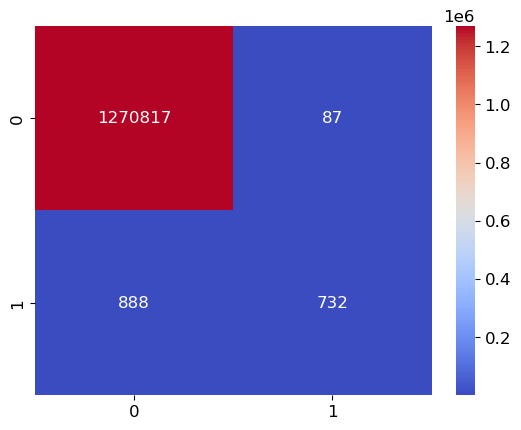
- True Positive - 1270817
- True Negative - 732
- False Positive - 87
- False Negative 888

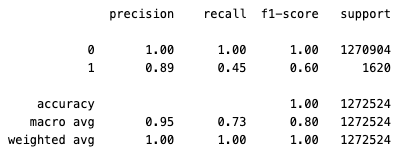
# Results from our classification report 

*Non-Fraud "0"*
 - Precision -- 1.00: When the model predicts a transaction as non-fraud, it is almost always correct 
 - Recall --  1.00: The model catches all non-fraud cases
 - F1- Score -- 1.00: A perfect balance of precision and recall, meaning this class is very well predicted 
- Support -- 1270904: amount of non-fraud cases used for this report 

*Fraud "1"*
 - Precision -- 0.89: When the model predicts fraud , it is correct 89% of the time
 - Recall -- 0.45: The model only detects 45% of the actual fraud cases, missing more than half of the fradulent transactions 
   - we have fradulent transactions slipping through undected, which could lead to losses and security risks
 - F-1 Score -- 0.60: the balance between precision and recall shows room for imporvement in fraud detection
 - Support -- 1620: Amount of fraud cases used for this report 

*Macro vs Weighted Averages*
- Macro Average -- 1.00 Precision, 1.00 recall , 1.00 F1- Score 
 - Treats both classes equally and shows that fraud detection is significantly lower than non-fraud detection
- Weighted Average -- 1.00 Precision , 1.00 Recall, 1.00 F1 score 
 - This dataset is highly imbalanced , so the weighted avg. is dominated by class 0 
- Support-- 1272524: Amount of total transactions used (fraud & non-fraud)

*A closer look into support*
- Class Imbalance 
- There are far fewer fraud cases (1,620) than non-fraud cases(1,270,904) used for this report
- This explains why accuracy is misleading - predicting "non-fraud" all the time would still be approx 99.9 accurate 

*In Summary*
* The high AUC suggests that the model is good at distinguishing between the two classes overall, 
but the lower recall for class 1 suggested that the model is missing a significant portion of the fraud cases (false negatives). 
The reason for this being an imbalanced dataset, where the non-fraud class (class 0) is much larger than the fraud class (class 1), 
causing the model to be more biased toward predicting the majority class (non-fraud).


