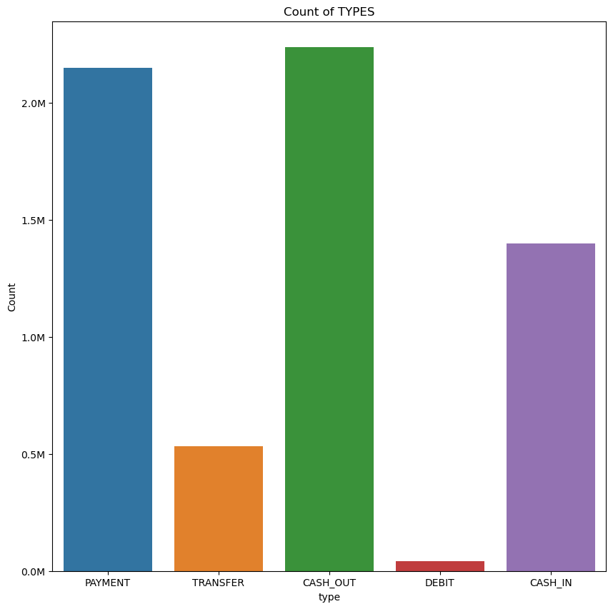

# Fraud Detection Analysis and Prediction :mag:

Welcome to the Fraud Analysis and Prediction project :rocket: We will be looking into a large data set and with using 
machine learning, figure out what accounts are fraud or not. Dive in to explore the data, modeling process and key findings.

## Modules/Libaries
* Pandas
* Seaborn
* Numpy 
* MatplotLib
* Scikit-learn


## Dataset Overview 
We will take a look at our Financial Data Set and give a few insights and points and draw a hypothesis given what we've looked at...

* Step: A unit of time that represents hours in the data. Think of this as the timestamp of the transaction (e.g hour 1, hour 2....hour 534, ...)

* Type: The type of transaction 

* Amount: The amount of money transferred 

* NameOrig: The origin account name 

* OldBalanceorg: The origin accounts balance before the transaction

* NewBalanceDest: The destination accounts balance after the transaction 

* IsFlaggedfraud: A "Naive" model that simply flags a transaction as fraudulent if it is greater than 200,000 (not that this currency is not USD)

* IsFraud: Was this simulated transaction actually fradulent? In this case, we condier "fraud" to be malicious transaction that aimed to transfer funds out of a victim's bank
account before the account owener could secure their information. 


## Univariate Analysis 


* The dataset is highly imbalanced, with 99.9% of transactions being non-fraudulent (6,354,407 accounts).
* In contrast, only 0.01% of transactions are flagged as fraudulent (8,213 accounts).

This imbalance is crucial to consider when building a fraud detection model, 
as traditional machine learning models may struggle to identify fraudulent cases due to their rarity.


* Flagged as fraud: Only 6 transactions
* Not flagged: 6,362,604

This indicates that very few cases are proactively flagged, suggesting that our fraud 
dection
system must be highly sensitve to subtle fradulent patterns. 




* Payment and cash_out are the 2 most common types within this data 

*Made dataframes where all the acounts were pulled for Fraud, Not Fraud, Flagged and Not Flagged 
and looked for any patterns*

```python 

#This pulls all the data where the account was fraud
fraud = df[df["isFraud"] == 1] 
#Pulls the data where the accounts were not fraud
Notfraud = df[df["isFraud"] == 0]

#Pulls all the data for what and what is not flagged fraud 
IsFlaggedFraud_df = df[df["isFlaggedFraud"] == 1]
IsNotFlaggedFraud_df = df[df["isFlaggedFraud"] == 0]

``` 
* As you explore the EDA you'll see these different dataframes and what i noticed is that...

1. under the fraud dataframe, transfers and cash out are the 2 most common types. 


* Over 95% of the samples fall into the "Not Fraud" category (represented as 0), while only a small fraction belong to the "Fraud" category.
* Among the "Not Fraud" samples, Payment and Cash Out are the most common types of transactions.
* Interestingly, the Debit type is the least common under "Not Fraud".
When we zoom into the "Fraud" category, the only transaction types observed are Cash Out and Transfers.


* This section dives deeper into the types of fraud, which we initially saw in the first bar plot.
* Transfers emerge as the most frequent type of fraudulent transaction, surpassing all other transaction types in the "Fraud" category.

2. IsFlaggedFraud_df, i noticed that only transfers were being marked as fraud. 


3. Lastly under IsNotFlaggedFraud_df
